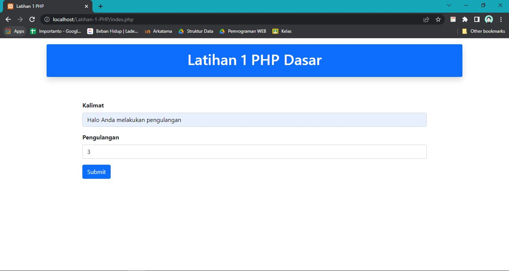
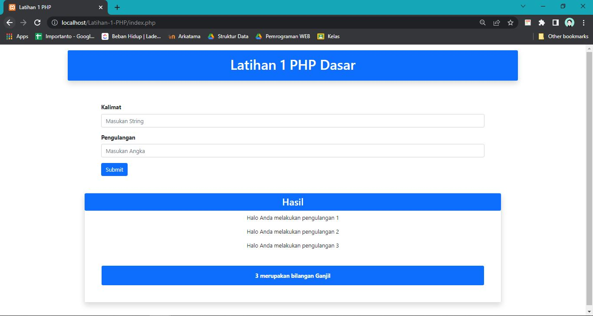

# Latihan-1-PHP Dasar
> Nama : Delfan Rynaldo Laden

> Kelas : FWD2
# Tampilan Input

Pada bagian form terdapat 2 inputan, yaitu inputan kalimat dengan masukan berupa string dan inputan pengulangan dengan masukan berupa angka.

# Tampilan Output

Maka ketika kita menekan tombol submit akan menampilkan teks secara berulangan sebanyak angka yang kita inputkan, lalu menampilkan untuk inputan angka yang kita masukan itu termasuk Ganjil / Genap.